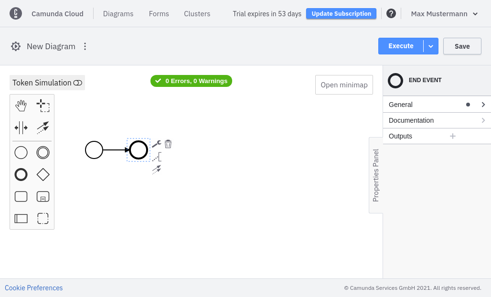

Beginner
Time estimate: 10 minutes

## Prerequisites

- Console Modeler or [Camunda Modeler](https://camunda.com/download/modeler/)

## Design and deploy a process

import Tabs from "@theme/Tabs";
import TabItem from "@theme/TabItem";

In Camunda Cloud, you have two options to design and deploy a process: Console Modeler and [Camunda Modeler](https://camunda.com/download/modeler/).

<Tabs groupId="modeler" defaultValue="console" values={
[
{label: 'Console Modeler', value: 'console', },
{label: 'Camunda Modeler', value: 'desktop', },
]
}>

<TabItem value='console'>

Using Cloud Modeler, processes are designed and deployed, and new instances are created directly from the console. Take the following steps:

1. Find your saved models under the **Diagrams** tab.

2. Click **Create New Diagram**.

3. Add an **EndEvent** to create a valid BPMN diagram.

4. To save your diagram, click **Save**.

</TabItem>

<TabItem value='desktop'>

Using Camunda Modeler, processes are designed and deployed, and new instances are created.

Design a simple process with one start event and one end event, or download this [BPMN model](./bpmn/gettingstarted_quickstart.bpmn).

</TabItem>
</Tabs>

## Next steps

- [Deploy and start your process instance](deploy-your-process-and-start-process-instance.md)
- [Camunda Modeler and Cloud Modeler](../components/modeler/overview.md)
