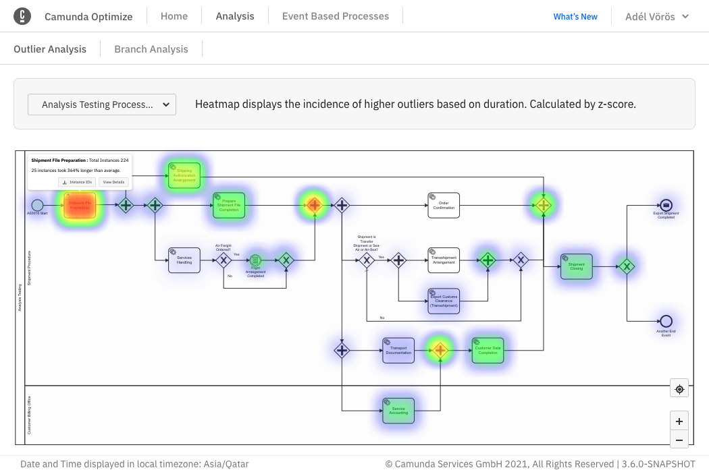
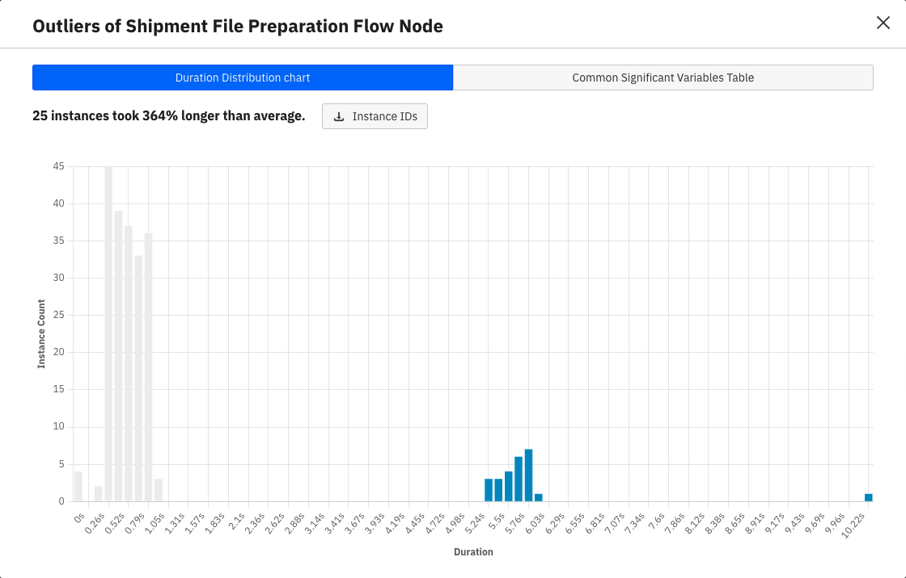
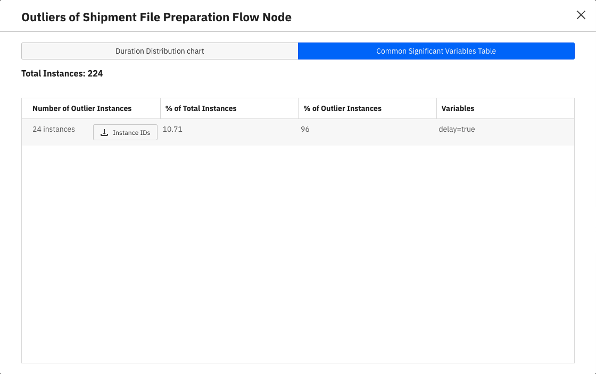

## Overview

Outlier analysis allows you to easily identify process instances that took significantly longer than others to complete a flow node, and subsequently slow down your process.

## Outlier analysis in action

Select a process definition that you would like to analyze. Once a definition is selected, a **heatmap** is displayed which highlights the flow nodes where Optimize identified many duration outliers. In our example, the **Approve Invoice** activity has duration outliers. When hovering over the task, you can see how many instances were identified and how much longer they took than the average duration.

Click on **View Details** to directly see a duration distribution chart for the specific flow node. The duration distribution chart contains information about how long the identified outliers took, also in comparison to the other flow node instance durations.

## Significant variable values

When looking at the duration outlier instances, you can analyze the data further to find the root cause of why these instances took so long. Click on the significant variables tab to view a table that lists significant variable values in the outlier instances.

It also allows you to see how many times this variable value occurred in the outlier instances compared to the rest of the process instances. This can give you a good idea of whether there is a correlation between a variable value and a flow node taking more time than expected. In our example, we can see that for most of our duration outliers, the delay variable was set to `true`.

